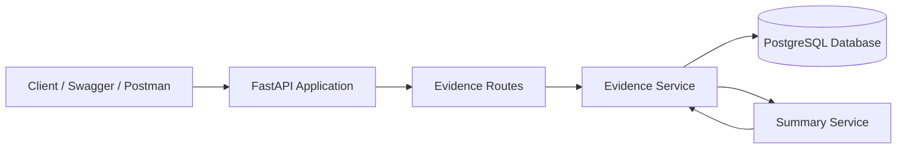

# 🏥 Healthcare Evidence Backend


A clean and beginner-friendly **FastAPI backend** for managing healthcare evidence records.  
This project allows users to create, view, update, delete, and summarize healthcare evidence using a REST API.

---

## ✨ What This Project Does

The **Healthcare Evidence Backend** is designed to store healthcare-related evidence such as research papers, medical articles, clinical findings, or study notes.

It supports:

✅ Create healthcare evidence records  
✅ View all evidence records  
✅ View evidence by ID  
✅ Update evidence records  
✅ Delete evidence records  
✅ Generate a simple summary for stored evidence  
✅ Validate requests using Pydantic  
✅ Persist data using PostgreSQL and SQLAlchemy  
✅ Explore APIs using Swagger UI

---

## 🧠 Main Idea



---

## 🛠️ Tech Stack

| Layer | Technology |
|---|---|
| Backend Framework | FastAPI |
| Language | Python |
| Database | PostgreSQL |
| ORM | SQLAlchemy |
| Validation | Pydantic |
| Settings Management | pydantic-settings / python-dotenv |
| Server | Uvicorn |
| Testing Tools | pytest, httpx |

---

## 📁 Project Structure

```text
healthcare-evidence-backend/
│
├── app/
│   ├── api/
│   │   └── evidence_routes.py
│   │
│   ├── core/
│   │   └── config.py
│   │
│   ├── db/
│   │   └── database.py
│   │
│   ├── models/
│   │   └── evidence.py
│   │
│   ├── schemas/
│   │   └── evidence_schema.py
│   │
│   ├── services/
│   │   ├── evidence_service.py
│   │   └── summary_service.py
│   │
│   └── main.py
│
├── requirements.txt
└── README.md
```

---

## 🚀 Getting Started

### 1️⃣ Clone the Repository

```bash
git clone https://github.com/SalithaEkanayaka123/healthcare-evidence-backend.git
cd healthcare-evidence-backend
```

### 2️⃣ Create a Virtual Environment

```bash
python -m venv venv
```

Activate it:

**Windows**

```bash
venv\Scripts\activate
```

**Linux / macOS**

```bash
source venv/bin/activate
```

### 3️⃣ Install Dependencies

```bash
pip install -r requirements.txt
```

### 4️⃣ Configure Environment Variables

### 5️⃣ Run the Application

```bash
uvicorn app.main:app --reload
```

The application will start at:

```text
http://localhost:8000
```

---

## 📚 API Documentation

FastAPI automatically provides interactive API documentation.

| Tool | URL |
|---|---|
| Swagger UI | http://localhost:8000/docs |
| ReDoc | http://localhost:8000/redoc |
| Health Check | http://localhost:8000/health |

---

## 🔗 API Endpoints

Base URL:

```text
http://localhost:8000/api/evidence
```

| Method | Endpoint | Description |
|---|---|---|
| POST | `/api/evidence` | Create a new evidence record |
| GET | `/api/evidence` | Get all evidence records |
| GET | `/api/evidence/{evidence_id}` | Get evidence by ID |
| PUT | `/api/evidence/{evidence_id}` | Update evidence by ID |
| DELETE | `/api/evidence/{evidence_id}` | Delete evidence by ID |
| POST | `/api/evidence/{evidence_id}/summary` | Generate summary for evidence |
| GET | `/health` | Check service health |

---

## 📥 Create Evidence Example

### Request

```bash
curl -X POST "http://localhost:8000/api/evidence" \
  -H "accept: application/json" \
  -H "Content-Type: application/json" \
  -d '{
    "title": "Diabetic Retinopathy CNN Study",
    "source": "Research Paper",
    "content": "CNN models can classify diabetic retinopathy images with useful performance when preprocessing, augmentation, and validation techniques are applied properly."
  }'
```

### Response

```json
{
  "id": 1,
  "title": "Diabetic Retinopathy CNN Study",
  "source": "Research Paper",
  "content": "CNN models can classify diabetic retinopathy images with useful performance when preprocessing, augmentation, and validation techniques are applied properly.",
  "summary": null,
  "created_at": "2026-05-30T11:38:50.465361"
}
```

---

## 🧾 Request Body Format

```json
{
  "title": "string",
  "source": "string",
  "content": "string"
}
```

### Validation Rules

| Field | Rule |
|---|---|
| title | Required, minimum 3 characters, maximum 150 characters |
| source | Required, minimum 2 characters, maximum 100 characters |
| content | Required, minimum 20 characters |

---

## 📝 Generate Summary Example

```bash
curl -X POST "http://localhost:8000/api/evidence/1/summary" \
  -H "accept: application/json"
```

Example response:

```json
{
  "evidence_id": 1,
  "summary": "Summary for 'Diabetic Retinopathy CNN Study' : CNN models can classify diabetic retinopathy images with useful performance when preprocessing, augmentation, and validation techniques are applied properly.This evidence may support healthcare decision-making, but it should be reviewed by a domain expert."
}
```

---

## ✅ Health Check

```bash
curl http://localhost:8000/health
```

Example response:

```json
{
  "status": "UP",
  "service": "Healthcare Evidence Backend"
}
```

---

## 🧪 Running Tests

```bash
pytest
```

---

## 🧩 Core Components

<details>
<summary><strong>📌 FastAPI App</strong></summary>

The application is initialized in `app/main.py`.  
It registers the evidence router under the `/api/evidence` prefix and exposes a `/health` endpoint.

</details>

<details>
<summary><strong>📌 Evidence Routes</strong></summary>

`app/api/evidence_routes.py` contains all REST endpoints related to evidence management.

</details>

<details>
<summary><strong>📌 Evidence Service</strong></summary>

`app/services/evidence_service.py` contains the business logic for creating, reading, updating, deleting, and summarizing evidence records.

</details>

<details>
<summary><strong>📌 Summary Service</strong></summary>

`app/services/summary_service.py` currently generates a simple summary by taking the first 35 words of the evidence content and appending a healthcare review disclaimer.

</details>

<details>
<summary><strong>📌 Database Layer</strong></summary>

`app/db/database.py` configures the SQLAlchemy engine, database session, and base model used by the application.

</details>

---

## 🗄️ Database Model

The main table is:

```text
evidence
```

| Column | Type | Description |
|---|---|---|
| id | Integer | Primary key |
| title | String(150) | Evidence title |
| source | String(100) | Evidence source |
| content | Text | Evidence content |
| summary | Text | Generated summary |
| created_at | DateTime | Record creation timestamp |

---

## 🌱 Learning Outcomes

This project is useful for learning:

- FastAPI project structure
- REST API development
- Request and response validation using Pydantic
- SQLAlchemy ORM basics
- PostgreSQL integration
- Service-layer architecture
- Environment-based configuration
- Swagger API testing
- Basic backend testing with pytest and httpx

---

## 🚧 Future Improvements

- Add Alembic database migrations
- Add proper unit and integration tests
- Add pagination for evidence listing
- Add search and filtering by title/source
- Add authentication and authorization
- Improve summary generation using an LLM
- Add Docker support
- Add CI/CD workflow using GitHub Actions
- Add global exception handling
- Add logging and monitoring

---

## 👨‍💻 Author

**Salitha Ekanayaka**

GitHub: [@SalithaEkanayaka123](https://github.com/SalithaEkanayaka123)

---

## ⭐ Support

If this project helps you learn FastAPI or backend development, consider giving it a ⭐ on GitHub.
